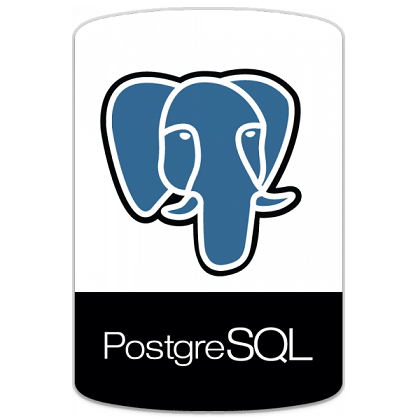

# Project
- Multiform (statist and operator) application fo Postgre-db.
                   
 

# Features  
- Connect application to PostgreSQL server.
- Select, search and edit data.

## Files

| File | Contents | 
| --- | --- |
| Frames\Search.pas | Base search frame unit |
| Forms\Oper.pas | Edit data unit |
| Forms\Statist.pas | Statistic functions unit |
| Forms\Child.pas | parent form for Statist and Oper units |
| Forms\Main.pas | main application form unit |
| Db\Dm.pas | common DataModule for db connection |
| Project1.dpr | The main project file |
| Project1.dproj | The MSBUILD project file |
| README.md | This readme file |
